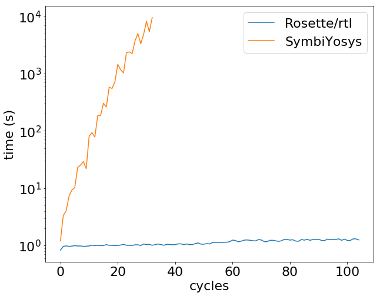

# Deterministic start benchmark: SymbiYosys versus rtl

This repository contains code to benchmark [SymbiYosys] versus [rtl] for
formally verifying a property that requires reasoning about a circuit's
execution over a large number of cycles.

The property that we benchmark is called "deterministic start". At a high
level, a SoC satisfies deterministic start if it clears all of its internal
state after some fixed number of cycles after the reset line is asserted. See
the [Notary paper][sosp-paper] or the [Notary GitHub repo][notary-github] for
more details on deterministic start.

For this verification task, SymbiYosys does not scale well. This is because of
the encoding that SymbiYosys uses: it effectively requires the SMT solver to
reason about the circuit's execution, even when most of the values in the
circuit can be shown to be concrete values. On the other hand, rtl uses
symbolic execution, using [Rosette] plus some extra tricks to obtain much
better performance when running over many cycles, because most of the
computation happens concretely in Racket/Rosette.

[SymbiYosys]: https://symbiyosys.readthedocs.io/
[rtl]: https://github.com/anishathalye/rtl
[sosp-paper]: https://pdos.csail.mit.edu/papers/notary:sosp19.pdf
[notary-github]: https://github.com/anishathalye/notary

## Encoding the property

### rtl

rtl uses the `rtl/shiva` library to prove deterministic start. This
special-purpose tool does symbolic execution and makes use of intermediate
solver queries to build up a final solver query.

### SymbiYosys

To encode the property using SystemVerilog Assertions so that we can verify it
using SymbiYosys, we instantiate two unconstrained copies of the SoC, assume
that the reset line is asserted at the first cycle (and de-asserted for
subsequent cycles), and we assert that their internal state is equivalent after
N cycles. If this property holds, it shows that after N cycles, both copies of
the SoC must be equal, which means that there is only one possible value for
its internal state. Due to a limitation in SymbiYosys, we can't access signals
internal to a sub-module using dot notation, so we manually expose all internal
state to the top-level. To see the encoding, generate the SymbiYosys input
files (see below) and examine a particular file, e.g. `verify_cycles_104.sv`.

## Scalability

Our goal is to benchmark SymbiYosys versus rtl for proving a property that
requires reasoning over many cycles of execution. To derive a scalability plot,
we use the tools to check a property like deterministic start for a subset of
the state (such that it could hold over a smaller number of cycles). In other
words, we use the tools to prove that a particular subset of state is cleared
after 1 cycle, after 2 cycles, etc., and we measure how proof time scales with
the number of cycles of circuit execution.

To determine in the first place which subset of state is cleared after a
particular number of cycles, which is required to produce the SymbiYosys code
(that asserts that certain registers are equal after a certain number of
cycles), we "cheat" and use a script based on `rtl/shiva`.

## Use

To generate all the input cases, run `make`.

To run the benchmarks, run `python3 bench-{symbiyosys,racket}.py`. This will
produce files `bench-{symbiyosys,racket}.txt` that contain timing measurements.

## Dependencies

- [RISC-V compiler toolchain]
- [bin2coe]
- [Yosys]
- [SymbiYosys]
- [Racket]
    - [Rosette]
    - [rtl]

[Rosette]: https://github.com/emina/rosette
[bin2coe]: https://github.com/anishathalye/bin2coe
[RISC-V compiler toolchain]: https://github.com/riscv/riscv-gnu-toolchain
[Yosys]: https://github.com/YosysHQ/yosys
[Racket]: https://racket-lang.org/
